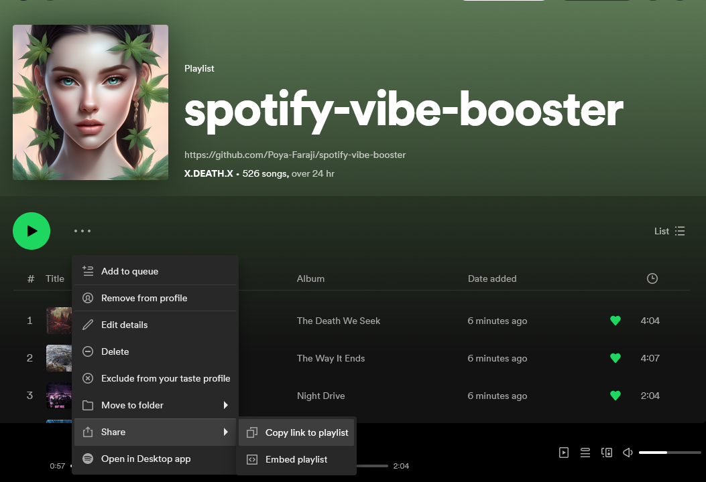

# Spotify Vibe Booster 🎶✨

<p align="center">
  
</p>

Elevate your gaming and chill sessions with the **Spotify Vibe Booster**! 🚀🎮

## What is Spotify Vibe Booster?

Introducing the Spotify Vibe Playlist Generator! Elevate your Discord server's atmosphere with personalized playlists crafted just for you. This simple script transforms your beloved Spotify favorites into a dedicated playlist. Copy the playlist URL generated by vibe-booster, paste it into your Discord bot, and immerse yourself in the perfect musical backdrop for your gaming adventures or chill sessions. Let the Spotify Vibe Playlist Generator be your go-to for curating the ultimate sound experience. 🚀🎵

## How to Use

### Step 1: Get Your Spotify Developer Credentials 🎩🔑

1. **Create a Spotify Developer App:**
   - Visit [Spotify Developer Dashboard](https://developer.spotify.com/dashboard/applications).
   - Create a new app and note down your `Client ID` and `Client Secret`. 🚀

### Step 2: Add Your Credentials to the Script 🖊️🔒

2. **Open the Script:**

   - Open the `spotify-vibe-booster.py` file.

3. **Replace the Placeholder Values:**
   - Replace `your_spotify_username` with your Spotify username.
   - Replace `your_client_id` with your Spotify Developer `Client ID`.
   - Replace `your_client_secret` with your Spotify Developer `Client Secret`. 🚀

### Step 3: Requirements and Setup 🛠️🚀

4. **Python and Libraries:**

   - If you are a **Windows user**, download Python from [python.org](https://www.python.org/downloads/) and ensure to check the option "Add Python to PATH" during installation. Afterward, open Command Prompt and continue with the following commands:

     ```bash
     pip install spotipy
     cd path\to\script
     python spotify-vibe-booster.py
     ```

   - If you are using **Linux or macOS**, Python usually comes pre-installed. Open Terminal and proceed with the following commands:

     ```bash
     pip install spotipy
     cd path/to/script
     python3 spotify-vibe-booster.py
     ```

5. **Editing the Script:**
   - Open the script using a code editor like Visual Studio Code or any text editor like Notepad.
   - Replace placeholder values as instructed.

### Step 4: Generate Your Vibe Playlist 🎵🔥

6. **Run the Script:**

   - Execute the script to create a playlist from your liked songs.

7. **Copy & Play:**
   - Copy the playlist URL and paste it into your Discord bot to set the perfect vibe. 🎮🎶

That's it! Say goodbye to dull background music and embrace the power of personalized playlists with Spotify Vibe Booster. 🚀✨

Feel the beats, boost your vibe, and enjoy the rhythm with Spotify Vibe Booster! 🎵✨

<p align="center">
  
</p>
